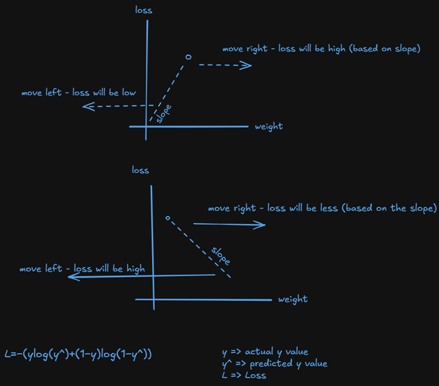

# Slope and loss, How they are related with graph

This is the picture which shows that how the slope and loss are related.

On X-axis weight, y-axis on loss, so the loss depends on the slope of the line, whether it is forward or backward.(as shown in above image.)

based on prediction of loss, what do you understand by loss is less? what do you understand by loss is more?

If i have to explain with example,
Actual = 1
prediction = 0.88  
(Actual and prediction are probabilities.)

so loss means => 1-0.88 = 0.12, here 0.12 is loss.

so if the loss is less it means that prediction is good
if the loss is more it means that prediction is bad.
