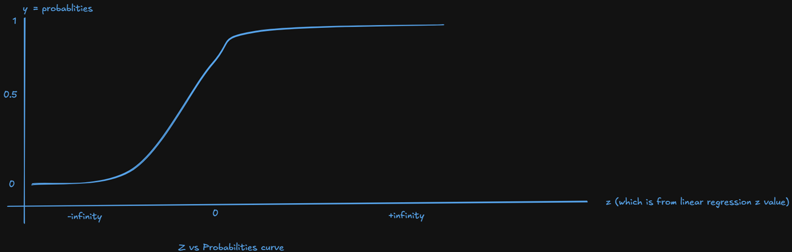

# Logistic regression explained to my non-technical friend.

## Block 1 — Sigmoid Function

So when we discussed before it was Linear regression, so the question might come like why can't we use linear regression in classification?. so i will start like this, in linear regression basically based on certain feature you will be predicting the value something, for example - house value prediction. based on the features like how much is the plot size, how many bed rooms and etc... it's the output from linear regression will be certain number it can be any number.

So, now we will come classification, so my next question will be, how will you classify something? suppose i have given you the data of hospital, you have to predict whether the patient is sick or not. for this number has to be between 1 or 0. 1 means positive (sick) and 0 means negative (not-sick basically healthy.) in linear regression you will get something number like 97.5 (consider it as example). so with this number how will you classify? it's basically not possible to tell the patient is sick or not. This is where logistic regression will come into picture. now, in-order to convert these real number into something useful for classification there is one function which will convert real number into probabilities to classify. that is nothing but sigmoid function. basically sigmoid function will take the, output from linear regression and convert that into probabilities like 0.1, 0.85, 0.9, 0.7, 0.5. and sigmoid function will use logerthemics to convert into probabilites. so how the sigmoid function convert these realnumbers into probabilities as follows, for example the values will be something as -infinity, 0, +infinty. so when we do use sigma function to convert these into probabilites, it will mostly becomes nearer to 0 or nearer to 1 and and when we 0 in sigmoid function it will becomes probability 0.5.

## Block 2 — Log-Loss / Binary Cross-Entropy

So From linear regression, there can be another question also arises right? that one will be like, why can not we use Mean Squared Error for logistic regression ? so the answer would be like, the loss surface we will get for linear regression that will be in the shape of convex, so that will prefectly worksout for linear regression. but if we use same MSE for logistic regression, the loss surface becomes non-convex and it will multiple valley shape and gradient descent will get struck. so because of that reason, MSE will not workout for logsitic regression. So then for logistic regression, how will you decode the loss? so i will explain you with example, suppose actual value for that sample is 1, but from the sigmoid function predicted that 0.88, now how much less that sigmoid function is predicted? its 0.12 - this is called loss. and there can be another example like actual value is 0, but sigmoid predicted the value can be 0.98. so the loss 0-0.98 = 0.98 is the loss. There is formula for loss as well loss = - 1/N Σ [y.log(p) + (1 - y).(log(p))]. so if we take the value from linear regression the values can be 0 also and this will be solved by sigmoid function exponential. and the values evantually fall nearer zero or 1 as shown in above image.

## Block 3 — Gradient Update Rule

Here when the loss is calculated we will be trying to eleminate the log-loss. So how we will reduce loss is by using w an b. based on the loss we got, taking the learning rate into consideration we will reduce the log-loss.
gradiant formulas as follows:
w = w - alpha . (p - y) . x
b = b - alpha . (p - y)
here p-y is the error or loss we will be getting. so how we will reduce is that - so suppose the actual value is 1 and predicted is 0.7 then loss is -0.3 which is negative. so we have to reduce the error. which means we have to increase the predicted value (0.8 or 0.9 from 0.7) then evantually error will reduce.
another example is that if the actual value is 0 and we got 0.8 then 0.8-0 = 0.8 the error is more then we have to reduce the error by reducing the predicted value (0.3 or 0.2 from 0.8) then the error will automatically reduce error or loss.
Here learning rate is also very important thing which needs to consider while calculating or reducing error in gradiant descent. we have to judge the learning rate precisely because if the learning rate too small we may not reach the targeted point where the error reduction becomes constant and at the same time if we increase the learning rate too much we might overshoot the error reduction curve. so we have to take the point where we can make sure that error reduction curve becomes constant. suppose the above explanation we suited with mountain, the step size is important right, while we coming towards downhill, if the step size too small, we might not get down where gradiant becomes normal. if we are making the step too big we might fall down might not reach state gradinat becomes normal.
This looks almost simillar to the linear regression, the only difference we can see is the sigmoid function in logistic regression sigmoid(wx + b), and in linear regression we will directly use z = wx+b.
The overall training loop in logistic regression looks as below:
Calculate z <------------------------------------.
| |
\|/ |
Calculate probabilites(sigma = sigmoid(z)) |
| |
\|/ |
Calculate gardiant descent |
| |
\|/ |
update the weights -------------------------------'

## Decision Boundary

From the logistic regression, when you calculate the probabilities which will be ranging from 0 to 1. so in this range you have decide the point/boundary which will decide the sample is positive and the other side you will get the negative sample. for example, by default 0.5 is considered as decision boundary like anything which falls >= 0.5 will be considered as sample as positive. the moment when you get probability 0.5 as decision boundary, for which z = 0, and for z = 0 considered as decision boundary in features space.

The decision boundary is linear because linear line will clearly distinct the postivie and negative sample. if the decision boundary is curve or multiple vallyes lines then it will become difficult to categorize the dataset.

The default threshold is 0.5, but this can be change from dataset to dataset based on the training. and this will change from the precision and recall based on the type of the dataset we are training. Meaning suppose if we are taking hospital dataset, missing out sick patient will cost the live of patient. so we will decide the threshold based on this line.

## When Logistic Regression Works / Fails

Logistic regression works when the sample is perfectly balanced means the amount of positive sample and negative samples are in balance so that model will read the patterns like when to decide the sample as positive and when to decide the sample as negative. so that it will work nicely on testing data.

Logistic regression works better when the features are rougly linearly separable and features are meaningful. so that we will get the coefficients interpretably.

Logistic regression will fail when the features are colinear, like one two features represent the same thing and model will get confuse which one to score more and which one to hammer.

Having more feature does not make the logistic regression better. it depends on many things like

- how many features are useful
- how many features are not-useful
- how many features are co-related
- if features are more and sample are less then logistic regression might not be useful

## Regularization's Role in Logistic Regression

Regularization plays important role in Logistic regression. Regularization has two algorithms L1 and L2. L2 Regression is default for the Logistic regression. while if we want L1 regression we have to represent it externally.
Regularization matters because in L2 regression, it will take into consideration of all features even though the feature contribution into the prediction is very less or irrelevant. while in L1 regression we can eliminate the certain features which are not required so if the sample or dataset is having the features which are irrelevant, L1 regression will have edge in logistic regression.
