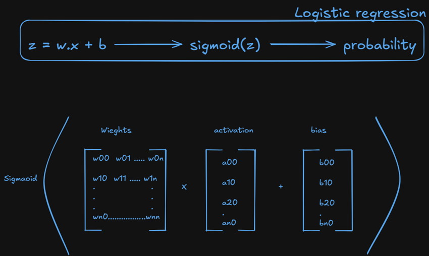
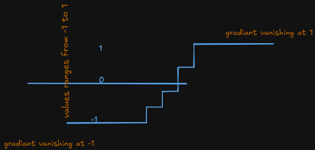

- If Logistic Regression already solves classification problems, why do we need Neural Networks?
  - Logistic regression will classify only if the decision boundary is linear. suppose if the decision boundary is non-linear then it fails. To solve this problem Neural Network came into picture.

Key take-aways:

- Logistic regression is linear decision boundary model
- But many real world problems are non - linear
- A nueral network is non-linear model
- neural network makes small decisions across layers and make final output decision.

A neuron is nothing but which holds the number.
The number ranges from 0-1, is called Activation.

Suppose if we have 28\*28 pixels, and represent some number ex: 7, these pixels will form the first layer, inorder to get the next layer, for each pixel which is nothing but neuron (contains activation) has to be multiplied with weight, then if we want bias that can be added, which will form the next layer like each new layer will form based on previous untill the final decision made. This network is called Neural Network.

### Why do we need activations?

activation function introduces a non-linearity into the neural network. without activation function it just like multiple linear models stacked together making it only linear model. this stacked linear model can not learn any complex non-linearity because of it is just a big stacked model. the activation function introduces non-linearity into the linear model system, making it to learn more complex non-linear relationship thorugh real-world.

### What is tanh?

The reason tanh to comeup is because, the sigmoid function gives the output values lies between 0 and 1 and these are always positive. only positive values are does not conveying what the exact perspective of feature usefulness. then tanh comes into picture in a way that, it gives ouput between -1 & 1. and it zero-centered as well. so if the values are coming nearer to -1 means that the feature is may not useful of training and if it nearer to 1 then it means that feature is useful for neural network training.

But the problem that stays with tanh is that it is still saturated means that for very large positive and negative values still lies near 1 and -1 making it linear and gradiant vanishes. It lead to discovery of ReLU

### What is ReLU?

ReLU - Rectified Linear Unit is another type of activation function. ReLU solves the problem which tanh has. tanh is having the problem like gradiant gets saturated at -1 and 1.

ReLU will work like if z < 0, the output will be 0, and if z > 0 then z. because of the sharp drop at 0, non-linearity will be introuduced.

### comparision table for Sigmoid, tanh and ReLU

| Property           |  Sigmoid  |   Tanh    |          ReLU          |
| :----------------- | :-------: | :-------: | :--------------------: |
| Output Range       |   0 - 1   |  -1 to 1  | 0 to positive infinity |
| Zero-Centered      |    ❌     |    ✅     |           ❌           |
| Vanishing Gradient |    ✅     |    ✅     |           ❌           |
| Computational Cost | very less | very less |  depend type of ReLU   |
