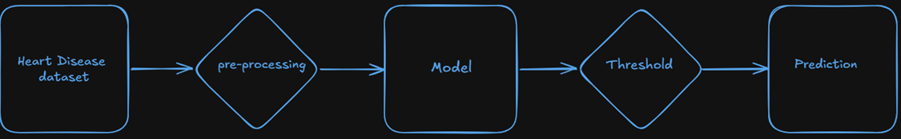

## Heart Disease Dataset

### Problem statement:

<p>Heart disease is major global health concern, Identifying the heart disease in early states signficantly improve the treatment process. In this project, From the dataset of patients which contains multiple features, the model will predict the heart disease risk based on the multiple features dataset trained.</p>

<p>When the prediction done by model, there will be business cost if we miss the patient who is having the heart disease.Missing a sick patient will have a big clinical/buisness cost in a way that next clincial treatment process is depends on the model prediction.</p>

<p>As we do not want to miss the sick patients, we are making the recall as priority over precision. So, incase of Heart disease predictions making recall is makes sense as the next stpe treatment will depends on prediction probability.</p>

### Approach and Data set:

This data set dates from 1988 and consists of four databases: Cleveland, Hungary, Switzerland, and Long Beach V. It contains 76 attributes, including the predicted attribute, but all published experiments refer to using a subset of 14 of them. The "target" field refers to the presence of heart disease in the patient. It is integer valued 0 = no disease and 1 = disease.

This dataset consists of 1024 rows means - it contains 1024 data samples. Dataset has features or attributes:

1. age
2. sex
3. chest pain type (4 values)
4. resting blood pressure
5. serum cholestoral in mg/dl
6. fasting blood sugar > 120 mg/dl
7. resting electrocardiographic results (values 0,1,2)
8. maximum heart rate achieved
9. exercise induced angina
10. oldpeak = ST depression induced by exercise relative to rest
11. the slope of the peak exercise ST segment
12. number of major vessels (0-3) colored by flourosopy
13. thal: 0 = normal; 1 = fixed defect; 2 = reversable defect
14. The names and social security numbers of the patients were recently removed from the database, replaced with dummy values.

class balance is very important before training the model with dataset. if the one class dominating the dataset, the model will just learn that class well from the dataset and it doesn't know how to predict the other class. The dataset used is balanced class data. class0-count : 499, class1-count:526
. So, from dataset it is clear that there is no one class is dominating the dataset.

The leackage checks that are been done in this project are:

1. checked - feature wise class count.
2. checked that if there are any features are corelated for that drawn heat-map.
3. while creating the pipeline, it is checked that for numeric features separate preprocessing pipeline and for categorical features separate preprocessing pipeline is created so that features will standardized according to it.

### Results Table:

Model Performance Comparison

| Model                    | Precision |   Recall | F1-Score |
| :----------------------- | --------: | -------: | -------: |
| Baseline                 |      0.74 |     0.87 |     0.80 |
| Logistic Regression (L2) |      0.74 |     0.87 |     0.80 |
| Logistic Regression (L1) |      0.75 |     0.88 |     0.81 |
| final_model              |  **0.72** | **0.93** | **0.81** |

### Architectural Diagram:

The architectural diagram for Heart disease diagram can be found below:


### Live Demo link:

Once the model is trained with dataset and compared all the metrics like precision vs recall vs ROC-AUC, as the target is to prioritize recall over precision and decision has been taken from the results table above, L1 is the best model. so best model is logged via mlflow. the model has been taken and created the Gradio app and deployed in the Hugging face.
Heart Disease Prediction live demo link: [click here](https://huggingface.co/spaces/mastanai/p1-tabular-ml)

## Local Setup

### Prerequisites

- Install the latest version of **Python**.
- Verify the installation:

```bash
python --version
```

---

### 1. Create a Virtual Environment

```bash
python -m venv .venv
```

---

### 2. Activate the Virtual Environment

**Windows (Command Prompt):**

```bash
.venv\Scripts\activate
```

**Windows (PowerShell):**

```powershell
.\.venv\Scripts\Activate.ps1
```

---

### 3. Clone the Repository

```bash
git clone https://github.com/MastanSV/ai-engineering-journey.git
```

---

### 4. Navigate to the Project Directory

```bash
cd ai-engineering-journey/projects/05_P1_Tabular_ML
```

---

### 5. Install the Dependencies

```bash
pip install -r requirements.txt
```

---

### 6. Run the Application

```bash
python app.py
```

---

### 7. Open the Application

Once the application starts successfully, you will see an output similar to:

```text
Running on local URL: http://127.0.0.1:7860
```

Open the URL in your browser to access the Heart Disease Prediction application.

> **Note:** The port may vary if `7860` is already in use.

### Loom Walkthrough

The Demo for Heart Disease prediction can found here: [click here](https://www.loom.com/share/804044ca8e2a4654a8db5f5b8e6c039e)
